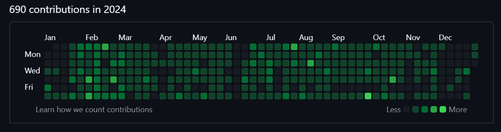

# My Profile

## About Me

I am a passionate developer with a rich history of projects and contributions. Unfortunately, my previous GitHub account (@haitham-alabdullah) was suspended, causing me to lose access to over 60 repositories, including many private ones. Despite this setback, I am determined to continue my work and share my knowledge with the community.

## Previous Work

Here are some highlights of my previous work:

- Developed numerous web applications using modern frameworks.
- Contributed to open-source projects, enhancing functionality and fixing bugs.
- Created several libraries and tools to improve developer productivity.

## Current Projects

I am currently rebuilding my portfolio and working on new projects. Stay tuned for updates!

## Images from My Projects

## Public Repositories from @haitham-alabdullah

Unfortunately, my previous account was suspended, and I lost access to all my repositories. Here are some of the public repositories that were available:

- [Flutter Dashboad](https://github.com/haitham-alabdullah/flutter-dashboard)
- [Azzan Time](https://github.com/haitham-alabdullah/azzan-time)
- [Laravel Cascase Soft-Deletes](https://github.com/haitham-alabdullah/laravel-cascade-soft-deletes)
- [Flutter Custom Dropdown](https://github.com/haitham-alabdullah/custom-dropdown)
- [Quran App](https://github.com/haitham-alabdullah/quran-app)
- [Word To Excel - appanded](https://github.com/haitham-alabdullah/WordToExcel)
- [LLAMA Models - not used yet](https://github.com/haitham-alabdullah/llama-models)

Thank you for your support and understanding as I rebuild my presence on GitHub.
